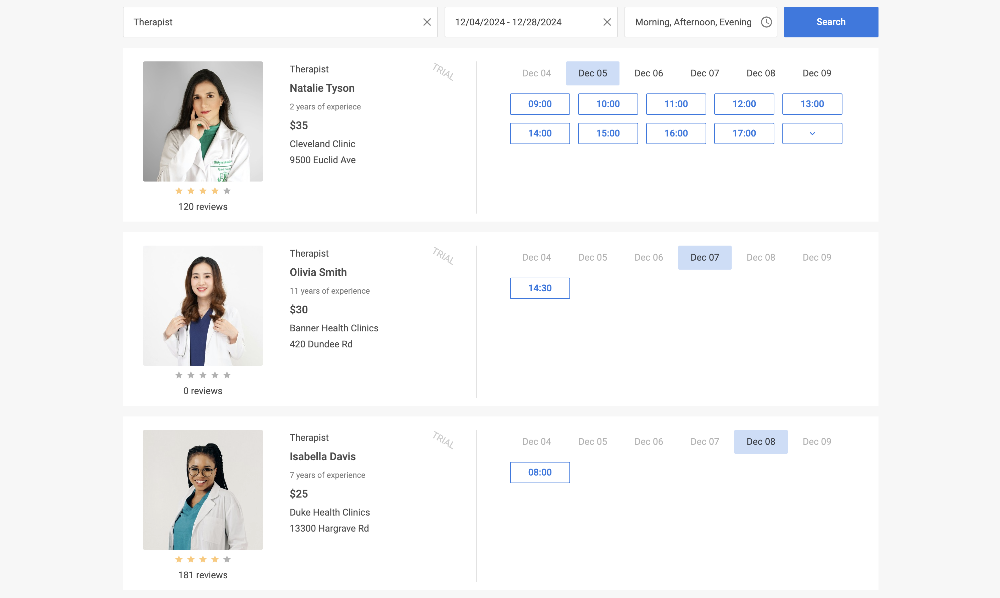

# Integration with React

:::tip
You should be familiar with the basic concepts and patterns of [**React**](https://react.dev) before reading this documentation. To refresh your knowledge, please refer to the [**React documentation**](https://react.dev/learn).
:::

DHTMLX Booking is compatible with **React**. We have prepared code examples on how to use DHTMLX Booking with **React**. For more information, refer to the corresponding [**Example on GitHub**](https://github.com/DHTMLX/react-booking-demo).

## Creating a project

:::info
Before you start to create a new project, install [**Vite**](https://vite.dev/) (optional) and [**Node.js**](https://nodejs.org/en/).
:::

You can create a basic **React** project or use **React with Vite**. Let's name the project as **my-react-booking-app**:

~~~json
npx create-react-app my-react-booking-app
~~~

### Installation of dependencies

Go to the new created app directory:

~~~json
cd my-react-booking-app
~~~

Install dependencies and start the dev server. For this, use a package manager:

- if you use [**yarn**](https://yarnpkg.com/), run the following commands:

~~~json
yarn
yarn start
~~~

- if you use [**npm**](https://www.npmjs.com/), run the following commands:

~~~json
npm install
npm run dev
~~~

The app should run on a localhost (for instance `http://localhost:3000`).

## Creating Booking

Now you should get the DHTMLX Booking source code. First of all, stop the app and proceed with installing the Booking package.

### Step 1. Package installation

Download the [**trial Booking package**](/how-to-start/#installing-trial-booking-via-npm-or-yarn) and follow steps mentioned in the README file. Note that trial Booking is available 30 days only.

### Step 2. Component creation

Now you need to create a React component, to add an Booking into the application. Create a new file in the ***src/*** directory and name it ***Booking.jsx***.

#### Import source files

Open the ***Booking.jsx*** file and import Booking source files. Note that:

- if you use PRO version and install the Booking package from a local folder, the import paths look like this:

~~~jsx title="Booking.jsx"
import { Booking } from 'dhx-booking-package';
import 'dhx-booking-package/dist/booking.css';
~~~

Note that depending on the used package, the source files can be minified. In this case make sure that you are importing the CSS file as ***booking.min.css***.

- if you use the trial version of Booking, specify the following paths:

~~~jsx title="Booking.jsx"
import { Booking } from '@dhx/trial-booking';
import "@dhx/trial-booking/dist/booking.css";
~~~

:::info
In this tutorial you can see how to configure the **trial** version of Booking.
:::

#### Setting the container and adding Booking

To display Booking on the page, you need to create the container for Booking, and initialize this component using the corresponding constructor:

~~~jsx {2,6,9-10,17} title="Booking.jsx"
import { useEffect, useRef } from "react";
import { Booking } from "@dhx/trial-booking";
import "@dhx/trial-booking/dist/booking.css"; // include Booking styles

export default function BookingComponent(props) {
    let container = useRef(); // initialize container for Booking

    useEffect(() => {
        // initialize the Booking component
        const booking = new Booking(container.current, {});

        return () => {
            booking.destructor(); // destruct Booking
        };
    }, []);

    return 

;
}
~~~

#### Adding styles

To display Booking correctly, you need to specify important styles for Booking and its container in the main css file of the project:

~~~css title="index.css"
/* specify styles for initial page */
html,
body,
#root {
    height: 100%;
    padding: 0;
    margin: 0;
}

/* specify styles for the Booking container */
.widget {
    height: 100%;
}
~~~

#### Loading data

To add data into the Booking, you need to provide a data set. You can create the ***data.js*** file in the ***src/*** directory and add some data into it:

~~~jsx title="data.js"
export function getData() {
    function getDate(addDays, hoursValue = 0, minutesValue = 0) {
        const date = new Date();
        const secondsValue = 0; // round to minutes
        const msValue = 0;
    
        date.setDate(date.getDate() + addDays);
        date.setHours(hoursValue, minutesValue, secondsValue, msValue);
    
        return date.getTime();
    }

    return [
        {
            id: "ee828b5d-a034-420c-889b-978840015d6a",
            title: "Natalie Tyson",
            category: "Therapist",
            subtitle: "2 years of experiece",
            details: "Cleveland Clinic\n9500 Euclid Ave",
            preview: "https://snippet.dhtmlx.com/codebase/data/booking/01/img/01.jpg",
            price: "$35",
            review: {
                stars: 4,
                count: 120
            },
            slots: [
                {
                    from: 9,
                    to: 20,
                    days: [1, 2, 3, 4, 5]
                },
                {
                    from: 10,
                    to: 18,
                    days: [6, 0]
                }
            ]
        },
        {
            id: "9b037564-77be-429f-b719-eebbe499027a",
            title: "Emma Johnson",
            category: "Cardiologist",
            subtitle: "2 years of experience",
            details: "Stanford Health Care\n1468 Madison Ave",
            preview: "https://snippet.dhtmlx.com/codebase/data/booking/01/img/03.jpg",
            price: "$25",
            review: {
                stars: 5,
                count: 10
            },
            slots: [
                {
                    from: 14,
                    to: 17,
                    size: 30,
                    gap: 10
                },
                {
                    from: 12,
                    to: 19,
                    size: 50,
                    gap: 20,
                    days: [2],
                    dates: [getDate(0)]
                },
                {
                    from: "18:30",
                    to: 20,
                    size: 20,
                    gap: 20,
                    days: [3, 4, 5]
                }
            ],
            usedSlots: [getDate(0, 12), getDate(0, 18)]
        },
        // ...
    ];
}
~~~

Then open the ***App.js*** file and import data. After this you can pass data into the new created `<Booking/>` components as **props**:

~~~jsx {2,5-6} title="App.js"
import Booking from "./Booking";
import { getData } from "./data";

function App() {
    const dataset = getData();
    return <Booking data={dataset} />;
}

export default App;
~~~

Go to the ***Booking.jsx*** file and apply the passed **props** to the Booking configuration object:

~~~jsx {5,10} title="Booking.jsx"
import { useEffect, useRef } from "react";
import { Booking } from "@dhx/trial-booking";
import "@dhx/trial-booking/dist/booking.css";

export default function BookingComponent(props) {
    let container = useRef(); 

    useEffect(() => {
        const booking = new Booking(container.current, {
            data: props.data
            // other configuration properties
        });

        return () => {
            booking.destructor();
        }
    }, []);

    return 

;
}
~~~

Now the Booking component is ready to use. When the element will be added to the page, it will initialize the Booking with data. You can provide necessary configuration settings as well. Visit our [Booking API docs](/api/overview/booking-properties-overview/) to check the full list of available properties.

#### Handling events

When a user makes some action in the Booking, it invokes an event. You can use these events to detect the action and run the desired code for it. See the [full list of events](/api/overview/booking-events-overview/).

Open ***Booking.jsx*** and complete the `useEffect()` method in the following way:

~~~jsx {5-8} title="Booking.jsx"
// ...
useEffect(() => {
    const booking = new Booking(container.current, {});

    // output the id of the selected slot
    booking.api.on("select-slot", (obj) => {
        console.log(obj.id);
    });
    
    return () => {
        booking.destructor();
    }
}, []);
// ...
~~~

After that, you can start the app to see Booking loaded with data on a page.

Now you know how to integrate DHTMLX Booking with React. You can customize the code according to your specific requirements. The final example you can find on [**GitHub**](https://github.com/DHTMLX/react-booking-demo).
