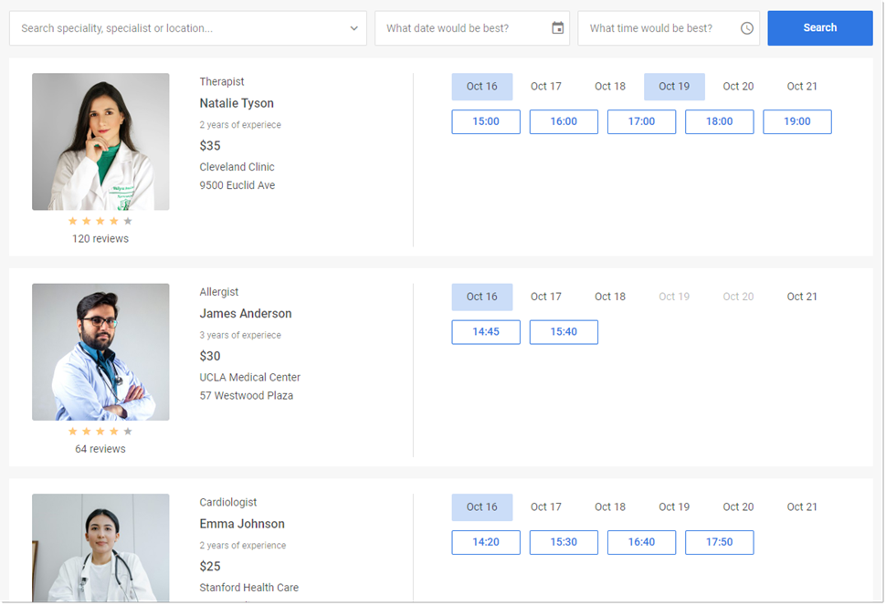

# How to start

Follow these steps to add a functional Booking application to your page.

## Step 1. Download and install packages

[Download the package](https://dhtmlx.com/docs/products/dhtmlxBooking/) and unpack it into your project folder.

Import Booking using `yarn` or `npm`:

### Install trial Booking via npm or yarn

:::info
If you want to use the trial version of Booking, download the trial [booking package](https://dhtmlx.com/docs/products/dhtmlxBooking/) and follow the steps mentioned in the *README* file. Note that trial booking is available for 30 days only.
:::

### Install PRO Booking via npm or yarn

:::info
You can access the DHTMLX private **npm** directly in the [Client's Area](https://dhtmlx.com/clients/) by generating your login and password for **npm**. A detailed installation guide is also available there. Please note that access to the private **npm** is available only while your proprietary Booking license is active.
:::

## Step 2. Include source files

Create an HTML file named `index.html` and include the Booking source files:

- `booking.js`
- `booking.css`

~~~html {5-6} title="index.html"
<!DOCTYPE html>
<html>
    <head>
        <title>How to Start with Booking</title>
           
        <link href="./dist/booking.css" rel="stylesheet">
    </head>
    <body>
        
    </body>
</html>
~~~

:::tip
To integrate Booking into React, Angular, or Vue projects, see the [**Examples on CodeSandbox**](https://codesandbox.io/u/DHTMLX).
:::

## Step 3. Create Booking

Add a container element and initialize Booking with the constructor:

~~~html {} title="index.html"
<!DOCTYPE html>
<html>
    <head>
        <title>How to Start with Booking</title>
           
        <link href="./dist/booking.css" rel="stylesheet">  
    </head>
    <body>
        

        
    </body>
</html>
~~~

## Step 4. Configure Booking

Provide the initial data and any additional configuration properties. The following code snippet creates Booking with two cards using these properties:

- [`data`](/api/config/booking-data) — adds card data, including title, image, rating, and booking slots
- [`cardShape`](/api/config/booking-cardshape) — configures which data fields to display on cards

~~~jsx {}
const data = [
    {
        id: "ee828b5d-a034-420c-889b-978840015d6a",
        title: "Natalie Tyson",
        category: "Therapist",
        subtitle: "2 years of experience",
        details: "Cleveland Clinic\n9500 Euclid Ave",
        preview: "https://snippet.dhtmlx.com/codebase/data/booking/01/img/01.jpg",
        price: "$35",
        review: {
            stars: 4,
            count: 120
        },
        slots: [
            {
                from: 9,
                to: 20,
                days: [1, 2, 3, 4, 5]
            },
            {
                from: 10,
                to: 18,
                days: [6, 0]
            }
        ]
    },
    {
        id: "5c9b64ad-1830-4e5b-a5f9-8acea10706df",
        title: "James Anderson",
        category: "Allergist",
        subtitle: "3 years of experience",
        details: "UCLA Medical Center\n57 Westwood Plaza",
        preview: "https://snippet.dhtmlx.com/codebase/data/booking/01/img/11.jpg",
        price: "$30",
        review: {
            stars: 4,
            count: 64
        },
        slotSize: 45,
        slotGap: 10,
        slots: [
            {
                from: "9:15",
                to: 17,
                days: [1, 2, 3, 4, 5]
            }
        ]
    }
];

const cardShape = {
    review: false,
    subtitle: false,
    price: false
};

new booking.Booking("#root", {
    data,
    cardShape,
    // other parameters
});
~~~

## What's next

Booking is ready. Explore the following resources to continue:

- [Guides](/category/guides) — instructions for installation, loading data, styling, and other configuration topics
- [API reference](/api/overview/booking-api-overview) — full description of the Booking functionality
