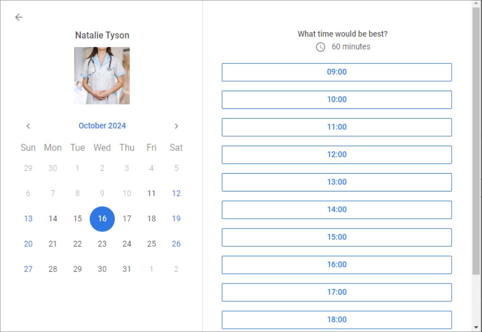
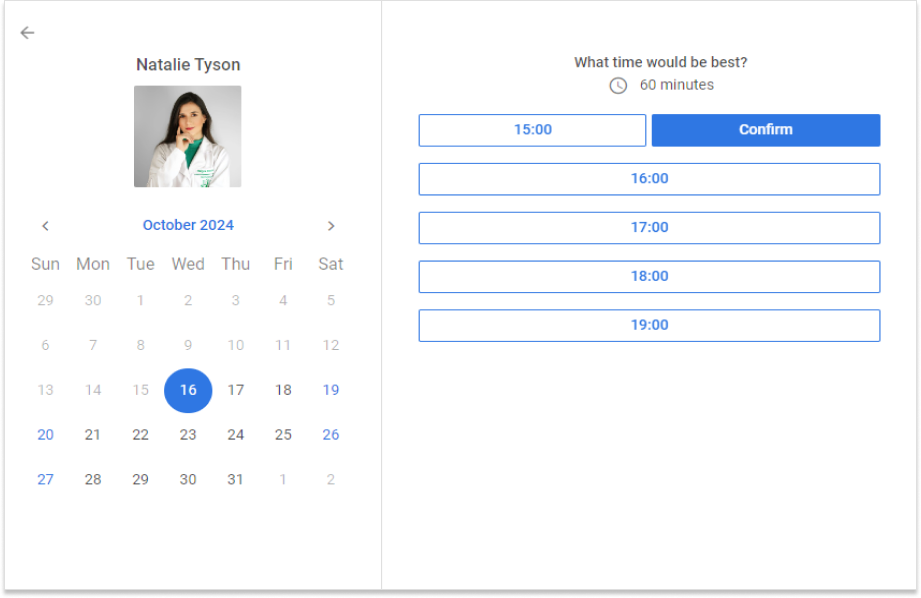

# DHTMLX Booking overview

JavaScript Booking is a ready-made component for scheduling appointments online. It provides filtering options and is optimized for mobile devices.

## Booking structure

The Booking UI has two main areas: the filter bar and the list of cards with slots. Each card includes an information block and available booking slots.

### Cards list

Cards appear as a list. The left side of each card shows the following fields:

- `preview` — card image
- `review` — rating information including the number of stars (out of five) and the number of reviews
- `category` — category name (e.g., a specialist's job)
- `title` — card title (e.g., a specialist's name)
- `subtitle` — card subtitle (e.g., experience details)
- `price` — service price
- `details` — additional card details

### Slots

The right side of each card shows clickable slots available for booking, starting from the current date.

### Single card view

Click the left area of a card to open the single card view. It shows the card title, a calendar, and available slots for the selected date.

### Booking dialog

The Booking dialog opens when you click a time slot button. Use it to book a slot for the selected card.

See [Make an appointment](#make-an-appointment) for step-by-step instructions.

## Filter data

Enter values in the filter fields and click **Search** to filter cards by text, date, and time. By default, cards are filterable by category and title. The following time ranges are available by default:

- `from: 8, to: 12` — Morning
- `from: 12, to: 17` — Afternoon
- `from: 17, to: 20` — Evening

Configure the filter settings with the API: [Configure the filter](/guides/configuration#configure-the-filter).

## Make an appointment

Click a time slot button for a card, fill in the fields in the **Booking** dialog, and click **Make an appointment**.

You can also book through the single card view:

1. Click the left area of a card.
2. In the single card view, select the required date and time.
3. Next to the selected time, click **Confirm**.
4. In the **Booking** dialog, fill in the fields, and click **Make an appointment**.

## What's next

[Start creating a Booking widget on your page](/how-to-start).
