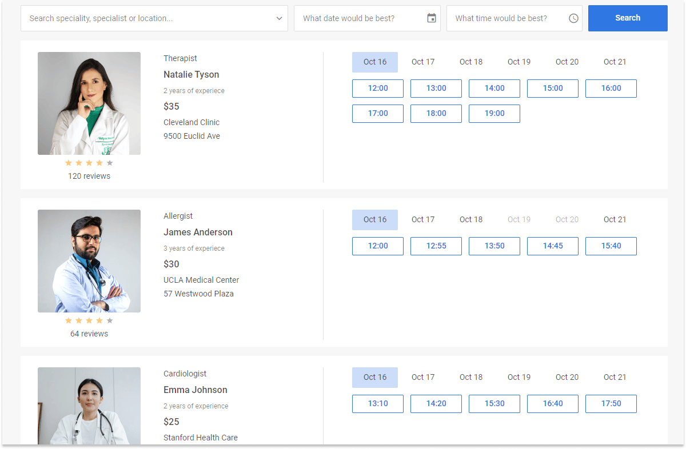
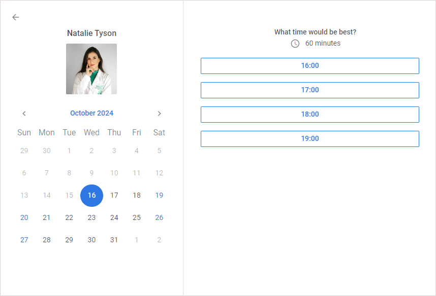
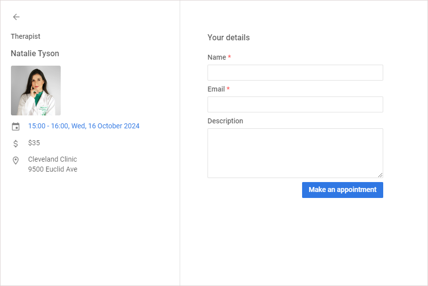
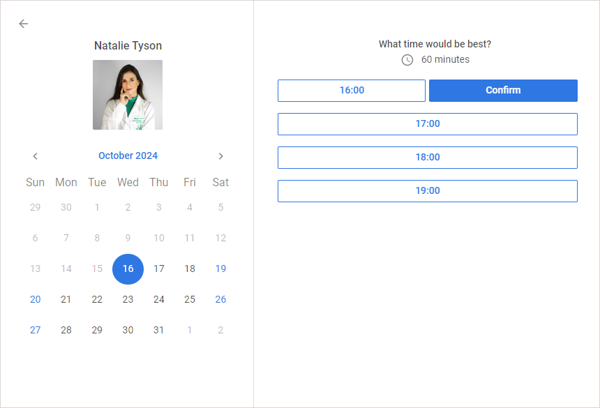

# DHTMLX Booking overview

## Overview

JavaScript Booking library is a ready-made component designed to be easily incorporated into your application. It provides end-users with functionality for scheduling appointments online and wide filtering options. The widget is made responsive and optimised for mobile devices. 

## Booking structure

The Booking UI includes the two main parts: the filter area and the list of cards with slots. Each card's view consists of the card's information block and slots available for booking. 

### Cards list

All cards are displayed as a list. The left side of each card in the list shows the following information items:

- preview: card image
- review: rating information with the number of rating stars (out of five) and the number of reviews
- category: the subtitle of a card
- title: the title of a card (for example, a specialist's name)
- subtitle: the subtitle of a card (for example, experience details)
- price: the price of the service
- details: other details of a card

### Slots

The right side of each card has clickable slots available for booking. Slots are displayed for the current month starting from the current date.

### A single card view

To open the view of a single card, click inside the left area of a card. The single card dialog shows the card's title, calendar and available slots for the date selected in the calendar. 

### Booking dialog

The booking dialog allows booking a slot of the selected card:

For the instruction about booking, please, refer to [Making an appointment](#making-an-appointment)

## Filtering data

To filter cards by different text fields, date and time, a user should enter the required values in the input fields and click the **Search** button. A user can filter  cards by category and title by default. The next default time ranges are available for filtering: 
- from: 8, to: 12 (Morning),
- from: 12, to: 17 (Afternoon),
- from: 17, to: 20 (Evening)

It's possible to configure the filter settings via API: [Configuring the filter](/guides/configuration#configuring-the-filter)

## Making an appointment

To schedule an appointment, click a slot for the required card, and in the **Booking** dialog, fill in the fields, and then click **Make an appointment**.

You can also make an appointment via the single card view:

1. Click inside the left area of a card.
2. In the single card view that opens, select the required date and time.
3. Next to the selected time, click **Confirm**.
4. In the **Booking** dialog that appears, fill in the fields, and then click **Make an appointment**.

## What's next

Now you can [start with creating a simple Booking widget on your page](/how-to-start).

