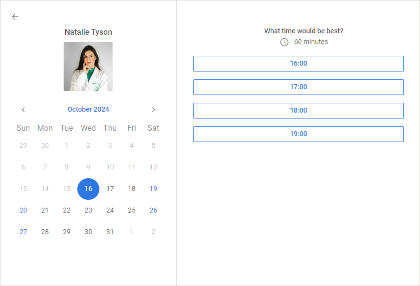
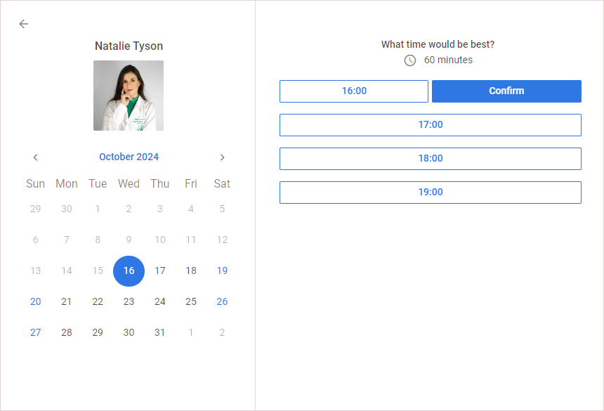

# DHTMLX Booking – Übersicht {#dhtmlx-booking-overview}

## Übersicht {#overview}

Die JavaScript Booking-Bibliothek ist eine fertige Komponente, die sich problemlos in Ihre Anwendung integrieren lässt. Sie bietet Endbenutzern die Möglichkeit, Termine online zu buchen, und stellt umfangreiche Filteroptionen bereit. Das Widget ist responsiv gestaltet und für mobile Geräte optimiert.

## Booking-Struktur {#booking-structure}

Die Booking-Oberfläche besteht aus zwei Hauptbereichen: dem Filterbereich und der Liste der Karten mit Slots. Jede Kartenansicht umfasst einen Informationsblock der Karte sowie die für die Buchung verfügbaren Slots.

### Kartenliste {#cards-list}

Alle Karten werden als Liste angezeigt. Die linke Seite jeder Karte in der Liste enthält folgende Informationen:

- preview: Kartenbild
- review: Bewertungsinformationen mit der Anzahl der Sterne (von fünf) und der Anzahl der Bewertungen
- category: der Kategoriename einer Karte (zum Beispiel der Beruf eines Spezialisten)
- title: der Titel einer Karte (zum Beispiel der Name eines Spezialisten)
- subtitle: der Untertitel einer Karte (zum Beispiel Angaben zur Erfahrung)
- price: der Preis der Dienstleistung
- details: weitere Details einer Karte

### Slots {#slots}

Die rechte Seite jeder Karte enthält anklickbare Slots, die für die Buchung verfügbar sind. Die Slots werden für die nächsten sechs Tage (vier auf schmalen Bildschirmen) ab dem aktuellen Datum oder dem im Filter ausgewählten Startdatum angezeigt.

### Einzelkartenansicht {#a-single-card-view}

Um die Ansicht einer einzelnen Karte zu öffnen, klicken Sie in den linken Bereich einer Karte. Der Einzelkarten-Dialog zeigt den Titel der Karte, einen Kalender sowie die für das im Kalender ausgewählte Datum verfügbaren Slots.

### Buchungsdialog {#booking-dialog}

Der Buchungsdialog ermöglicht die Buchung eines Slots der ausgewählten Karte. Klicken Sie dazu auf die Schaltfläche des gewünschten Zeitslots.

Anweisungen zur Buchung finden Sie unter [Einen Termin vereinbaren](#making-an-appointment).

## Daten filtern {#filtering-data}

Um Karten nach verschiedenen Textfeldern, Datum und Uhrzeit zu filtern, gibt der Benutzer die gewünschten Werte in die Eingabefelder ein und klickt auf die Schaltfläche **Suchen**. Standardmäßig können Karten nach Kategorie und Titel gefiltert werden. Die folgenden Standardzeitbereiche stehen für die Filterung zur Verfügung:

- von: 8, bis: 12 (Morgen)
- von: 12, bis: 17 (Nachmittag)
- von: 17, bis: 20 (Abend)

Die Filter-Einstellungen können über die API konfiguriert werden: [Filter konfigurieren](guides/configuration.md#configure-the-filter)

## Einen Termin vereinbaren {#making-an-appointment}

Um einen Termin zu vereinbaren, klicken Sie auf die Zeitslot-Schaltfläche der gewünschten Karte, füllen Sie im Dialog **Buchung** die Felder aus und klicken Sie anschließend auf **Termin vereinbaren**.

Sie können einen Termin auch über die Einzelkartenansicht vereinbaren:

1. Klicken Sie in den linken Bereich einer Karte.
2. Wählen Sie in der daraufhin geöffneten Einzelkartenansicht das gewünschte Datum und die gewünschte Uhrzeit aus.
3. Klicken Sie neben der ausgewählten Uhrzeit auf **Bestätigen**.
4. Füllen Sie im daraufhin erscheinenden Dialog **Buchung** die Felder aus und klicken Sie auf **Termin vereinbaren**.

## Wie geht es weiter? {#whats-next}

Jetzt können Sie [mit der Erstellung eines einfachen Booking-Widgets auf Ihrer Seite beginnen](how-to-start.md).
