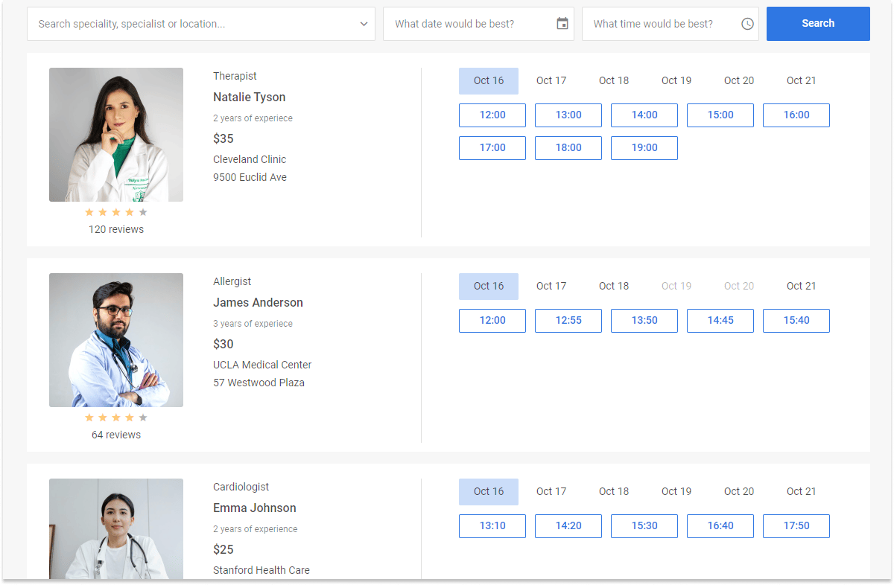
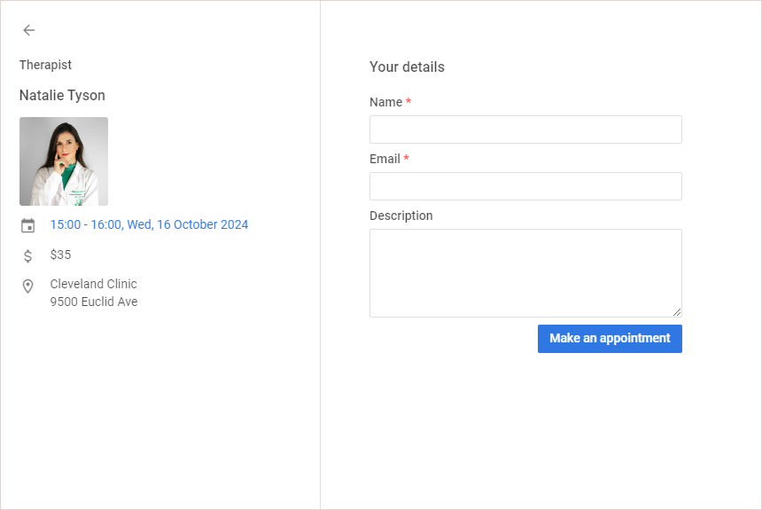

# DHTMLX Booking 개요

## 개요 {#overview}

JavaScript Booking 라이브러리는 애플리케이션에 손쉽게 통합할 수 있도록 설계된 기성 컴포넌트입니다. 사용자에게 온라인 예약 기능과 다양한 필터링 옵션을 제공합니다. 이 widget은 반응형으로 제작되어 모바일 기기에 최적화되어 있습니다.

## Booking 구조 {#booking-structure}

Booking UI는 필터 영역과 슬롯이 포함된 카드 목록, 두 가지 주요 부분으로 구성됩니다. 각 카드의 뷰는 카드 정보 블록과 예약 가능한 슬롯으로 이루어져 있습니다.

### 카드 목록 {#cards-list}

모든 카드는 목록 형태로 표시됩니다. 목록의 각 카드 왼쪽에는 다음 정보 항목이 표시됩니다:

- preview: 카드 이미지
- review: 별점 수(5점 만점)와 리뷰 수가 포함된 평점 정보
- category: 카드의 카테고리 이름(예: 전문가의 직종)
- title: 카드의 제목(예: 전문가의 이름)
- subtitle: 카드의 부제목(예: 경력 상세 정보)
- price: 서비스 가격
- details: 카드의 기타 상세 정보

### 슬롯 {#slots}

각 카드의 오른쪽에는 예약 가능한 클릭 가능한 슬롯이 표시됩니다. 슬롯은 현재 날짜 또는 필터에서 선택한 시작 날짜부터 이후 6일간(좁은 화면에서는 4일간) 표시됩니다.

### 단일 카드 뷰 {#a-single-card-view}

단일 카드의 뷰를 열려면 카드의 왼쪽 영역 내부를 클릭합니다. 단일 카드 다이얼로그에는 카드의 제목, 캘린더, 그리고 캘린더에서 선택한 날짜에 대한 예약 가능한 슬롯이 표시됩니다.

### 예약 다이얼로그 {#booking-dialog}

예약 다이얼로그를 사용하면 선택한 카드의 슬롯을 예약할 수 있습니다. 열려면 시간 슬롯 버튼을 클릭합니다.

예약 방법은 [예약하기](#making-an-appointment)를 참조하세요.

## 데이터 필터링 {#filtering-data}

다양한 텍스트 필드, 날짜 및 시간으로 카드를 필터링하려면 입력 필드에 원하는 값을 입력하고 **Search** 버튼을 클릭합니다. 기본적으로 카테고리와 제목으로 카드를 필터링할 수 있습니다. 필터링에 사용 가능한 기본 시간 범위는 다음과 같습니다:

- from: 8, to: 12 (오전)
- from: 12, to: 17 (오후)
- from: 17, to: 20 (저녁)

API를 통해 필터 설정을 구성할 수 있습니다: [필터 구성](guides/configuration.md#configure-the-filter)

## 예약하기 {#making-an-appointment}

예약을 진행하려면 원하는 카드의 시간 슬롯 버튼을 클릭하고, **Booking** 다이얼로그에서 필드를 작성한 후 **Make an appointment**를 클릭합니다.

단일 카드 뷰를 통해 예약할 수도 있습니다:

1. 카드의 왼쪽 영역 내부를 클릭합니다.
2. 열리는 단일 카드 뷰에서 원하는 날짜와 시간을 선택합니다.
3. 선택한 시간 옆의 **Confirm**을 클릭합니다.
4. 나타나는 **Booking** 다이얼로그에서 필드를 작성한 후 **Make an appointment**를 클릭합니다.

## 다음 단계 {#whats-next}

이제 [페이지에서 간단한 Booking widget 만들기를 시작](how-to-start.md)할 수 있습니다.
