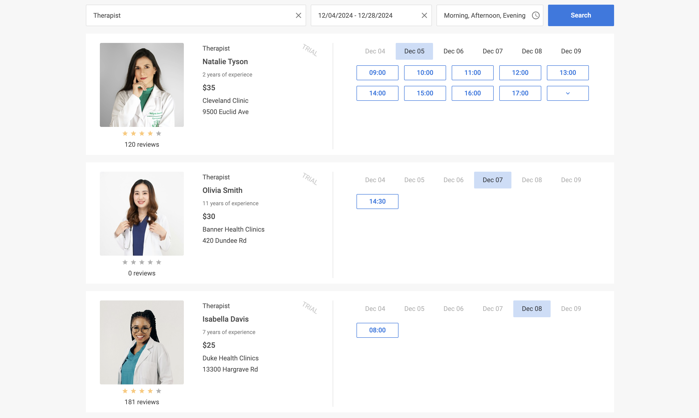

# Интеграция с Angular {#integration-with-angular}

DHTMLX Booking интегрируется с Angular через пользовательский компонент, оборачивающий конструктор виджета. Это руководство проведёт вас через создание нового проекта Angular, установку Booking и отображение виджета с данными и событиями. Полную эталонную реализацию смотрите в [примере Angular на GitHub](https://github.com/DHTMLX/angular-booking-demo).

:::tip
Данное руководство предполагает знакомство с основными концепциями Angular. Для введения см. [документацию Angular](https://v17.angular.io/docs).
:::

## Создание проекта {#create-a-project}

Создайте новое Angular-приложение с помощью Angular CLI перед добавлением интеграции с Booking.

:::info
Перед началом установите [Angular CLI](https://v17.angular.io/cli) и [Node.js](https://nodejs.org/en/).
:::

Следующая команда создаёт новый проект *my-angular-booking-app*:

~~~bash
ng new my-angular-booking-app
~~~

:::note
Отключите Server-Side Rendering (SSR) и Static Site Generation (SSG/Prerendering) при появлении соответствующего запроса в CLI. Виджет Booking монтируется в DOM на стороне клиента.
:::

Команда устанавливает все необходимые инструменты. Дополнительные команды не требуются.

### Установка зависимостей {#install-dependencies}

Перейдите в директорию проекта.

Следующая команда открывает папку только что созданного приложения:

~~~bash
cd my-angular-booking-app
~~~

Установите зависимости и запустите сервер разработки с помощью вашего пакетного менеджера.

Следующие команды используют [yarn](https://yarnpkg.com/):

~~~bash
yarn
yarn start
~~~

Следующие команды используют [npm](https://www.npmjs.com/):

~~~bash
npm install
npm start
~~~

Приложение запускается на localhost, например *http://localhost:4200*.

## Добавление Booking в приложение {#add-booking-to-the-app}

Остановите сервер разработки перед установкой пакета Booking, затем создайте Angular-компонент, оборачивающий виджет.

### Шаг 1. Установка пакета {#step-1-install-the-package}

Загрузите [пробный пакет Booking](how-to-start.md#installing-trial-booking-via-npm-or-yarn) и следуйте инструкциям в README пакета. Пробная версия действует 30 дней.

### Шаг 2. Создание компонента Booking {#step-2-create-the-booking-component}

Создайте папку *booking* в директории *src/app/* и добавьте в неё файл *booking.component.ts*. Выполните шаги ниже, чтобы подключить виджет.

#### Импорт исходных файлов {#import-the-source-files}

Импортируйте класс Booking, указав путь, соответствующий вашей версии дистрибутива:

- *dhx-booking-package* — PRO-версия, установленная из локальной папки
- *@dhx/trial-booking* — пробная версия

Следующий фрагмент кода импортирует Booking из PRO-пакета:

~~~ts
import { Booking } from 'dhx-booking-package';
~~~

Следующий фрагмент кода импортирует Booking из пробного пакета:

~~~ts
import { Booking } from '@dhx/trial-booking';
~~~

:::info
В этом руководстве используется пробная версия Booking.
:::

#### Установка контейнера и инициализация Booking {#set-the-container-and-initialize-booking}

Определите хост-контейнер в шаблоне компонента и создайте экземпляр Booking в `ngOnInit()`. Вызовите `destructor()` в `ngOnDestroy()`, чтобы размонтировать виджет при удалении компонента Angular.

Следующий фрагмент кода объявляет компонент Booking с элементом-контейнером и хуками жизненного цикла:

~~~ts {1,8,12-13,18-19} title="booking.component.ts"
import { Booking } from '@dhx/trial-booking';
import { Component, ElementRef, OnInit, ViewChild, OnDestroy, ViewEncapsulation } from '@angular/core';

@Component({
    encapsulation: ViewEncapsulation.None,
    selector: "booking", // используется в app.component.ts как <booking />
    styleUrls: ["./booking.component.css"],
    template: `

`,
})

export class BookingComponent implements OnInit, OnDestroy {
    // хост-контейнер для Booking
    @ViewChild('container', { static: true }) booking_container!: ElementRef;

    private _booking!: Booking;

    ngOnInit() {
        // создаём экземпляр Booking
        this._booking = new Booking(this.booking_container.nativeElement, {});
    }

    ngOnDestroy(): void {
        this._booking.destructor(); // размонтируем Booking
    }
}
~~~

#### Добавление стилей {#add-the-styles}

Booking требует как таблицы стилей виджета, так и контейнера с заданными размерами.

Создайте файл *booking.component.css* в директории *src/app/booking/*.

Следующий фрагмент кода импортирует таблицу стилей Booking и задаёт полную высоту для страницы и контейнера виджета:

~~~css title="booking.component.css"
/* импорт стилей Booking */
@import "@dhx/trial-booking/dist/booking.css";

/* стили страницы */
html,
body {
    margin: 0;
    padding: 0;
    height: 100%;
}

/* контейнер Booking */
.widget {
    height: 100%;
}
~~~

#### Загрузка данных {#load-data}

Чтобы загрузить данные карточек в Booking, подготовьте набор данных, соответствующий свойству [`data`](api/config/booking-data.md). Полный формат данных и сценарии загрузки см. в руководстве [Загрузка данных](guides/loading-data.md).

Создайте файл *data.ts* в директории *src/app/booking/*.

Следующий фрагмент кода определяет вспомогательную функцию `getData()`, возвращающую пример набора данных:

~~~ts title="data.ts"
export function getData() : any {
    function getDate(addDays : any, hoursValue = 0, minutesValue = 0) {
        const date = new Date();
        const secondsValue = 0; // округляем до минут
        const msValue = 0;

        date.setDate(date.getDate() + addDays);
        date.setHours(hoursValue, minutesValue, secondsValue, msValue);

        return date.getTime();
    }

    return [
        {
            id: "ee828b5d-a034-420c-889b-978840015d6a",
            title: "Natalie Tyson",
            category: "Therapist",
            subtitle: "2 years of experience",
            details: "Cleveland Clinic\n9500 Euclid Ave",
            preview: "https://snippet.dhtmlx.com/codebase/data/booking/01/img/01.jpg",
            price: "$35",
            review: {
                stars: 4,
                count: 120
            },
            slots: [
                {
                    from: 9,
                    to: 20,
                    days: [1, 2, 3, 4, 5]
                },
                {
                    from: 10,
                    to: 18,
                    days: [6, 0]
                }
            ]
        },
        {
            id: "9b037564-77be-429f-b719-eebbe499027a",
            title: "Emma Johnson",
            category: "Cardiologist",
            subtitle: "2 years of experience",
            details: "Stanford Health Care\n1468 Madison Ave",
            preview: "https://snippet.dhtmlx.com/codebase/data/booking/01/img/03.jpg",
            price: "$25",
            review: {
                stars: 5,
                count: 10
            },
            slots: [
                {
                    from: 14,
                    to: 17,
                    size: 30,
                    gap: 10
                },
                {
                    from: 12,
                    to: 19,
                    size: 50,
                    gap: 20,
                    days: [2],
                    dates: [getDate(0)]
                },
                {
                    from: "18:30",
                    to: 20,
                    size: 20,
                    gap: 20,
                    days: [3, 4, 5]
                },
            ],
            usedSlots: [getDate(0, 12), getDate(0, 18)]
        },
        // ...
    ];
}
~~~

Откройте *booking.component.ts*, импортируйте набор данных и передайте его в конфигурацию Booking внутри `ngOnInit()`.

Следующий фрагмент кода подключает `getData()` в конструктор Booking:

~~~ts {2,18,20} title="booking.component.ts"
import { Booking } from '@dhx/trial-booking';
import { getData } from "./data"; // импортируем данные
import { Component, ElementRef, OnInit, ViewChild, OnDestroy, ViewEncapsulation } from '@angular/core';

@Component({
    encapsulation: ViewEncapsulation.None,
    selector: "booking",
    styleUrls: ["./booking.component.css"],
    template: `

`,
})

export class BookingComponent implements OnInit, OnDestroy {
    @ViewChild('container', { static: true }) booking_container!: ElementRef;

    private _booking!: Booking;

    ngOnInit() {
        const data = getData(); // загружаем набор данных
        this._booking = new Booking(this.booking_container.nativeElement, {
            data
        });
    }

    ngOnDestroy(): void {
        this._booking.destructor();
    }
}
~~~

Компонент Booking теперь отображается с загруженными данными. Для дальнейшей настройки виджета передайте дополнительные свойства конфигурации — полный список см. в [Обзоре свойств](api/overview/booking-properties-overview.md).

#### Обработка событий {#handle-events}

Действие пользователя в виджете вызывает событие. Подпишитесь на событие с помощью `booking.api.on(eventName, handler)`, чтобы реагировать на это действие. Полный список событий см. в [Обзоре событий](api/overview/booking-events-overview.md).

Откройте *booking.component.ts* и расширьте `ngOnInit()` подпиской на событие.

Следующий фрагмент кода выводит в консоль идентификатор слота при его выборе пользователем:

~~~ts {7-10} title="booking.component.ts"
// ...
ngOnInit() {
    this._booking = new Booking(this.booking_container.nativeElement, {
        start: new Date(2024, 5, 10),
    });

    // выводим в консоль id выбранного слота
    this._booking.api.on("select-slot", (obj) => {
        console.log(obj.id);
    });
}

ngOnDestroy(): void {
    this._booking.destructor();
}
~~~

### Шаг 3. Регистрация Booking в приложении {#step-3-register-booking-in-the-app}

Добавьте `BookingComponent` в загрузку приложения. Откройте *src/app/app.component.ts* и замените код по умолчанию.

Следующий фрагмент кода отображает компонент Booking внутри `AppComponent`:

~~~ts {5} title="app.component.ts"
import { Component } from "@angular/core";

@Component({
    selector: "app-root",
    template: `<booking/>` // шаблон определён в booking.component.ts
})
export class AppComponent {
    name = "";
}
~~~

Создайте *app.module.ts* в *src/app/* и объявите оба компонента.

Следующий фрагмент кода регистрирует `AppComponent` и `BookingComponent` в корневом модуле:

~~~ts {4-5,8} title="app.module.ts"
import { NgModule } from "@angular/core";
import { BrowserModule } from "@angular/platform-browser";

import { AppComponent } from "./app.component";
import { BookingComponent } from "./booking/booking.component";

@NgModule({
    declarations: [AppComponent, BookingComponent],
    imports: [BrowserModule],
    bootstrap: [AppComponent]
})
export class AppModule {}
~~~

Откройте *src/main.ts* и выполните начальную загрузку корневого модуля.

Следующий фрагмент кода запускает приложение с `AppModule`:

~~~ts title="main.ts"
import { platformBrowserDynamic } from "@angular/platform-browser-dynamic";
import { AppModule } from "./app/app.module";
platformBrowserDynamic()
    .bootstrapModule(AppModule)
    .catch((err) => console.error(err));
~~~

Запустите приложение, чтобы увидеть Booking с загруженными данными на странице.

Настройте код в соответствии с требованиями вашего проекта. Полная эталонная реализация доступна на [GitHub](https://github.com/DHTMLX/angular-booking-demo).
